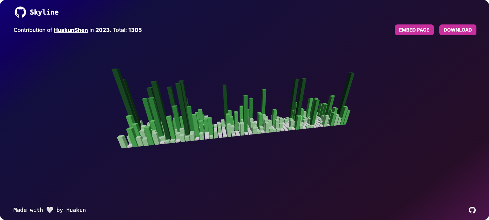

# Git-Skyline

## https://git-skyline.huakun.tech/

> The official GitHub Skyline web app https://skyline.github.com/ is down.
>
> So I decided to make a clone of this project.



## Features

- [x] 3D model
- [x] Contribution Year
- [x] Embed with `iframe`
- [x] Provide your own API Token
- [ ] Contribution by Date (given a start date and an end date)
- [ ] Git Providers
  - [x] GitHub
  - [ ] GitLab
  - [ ] Gitee

I thought about supporting other git providers like GitLab... But personally I only use GitHub.
If there are more people requesting support for other platforms, I will consider implementing it.
Feel free to send a PR for new features if you are willing to contribute.

### Embed Page

You can embed git-skyline webpage into your own web page using `iframe` with options to disable zoom, pan, auto-rotate, without the header/footer on the page.

> https://huakunshen.com/ and https://huakun.tech are examples of the embeded git skyline.

Click on the "Embed Page" button, it will take you to another web page with the 3D model alone. Put the url in an iframe.

```html
<iframe
  src="https://git-skyline.huakun.tech/contribution/github/huakunshen/embed?year=2023&enableZoom=false"
  width="100%"
  height="100%"
  frameborder="0"
></iframe>
```

### Options

The model by default enables `auto-rotate`, `damping`, `panning`, `zoom` interations, and disable model base. Sometimes you may not want these interactions on your web page.

You can simply add search params into the url

e.g. `?enableZoom=false&enableZoom=false&enablePan=false&enableDamping=false&autoRotate=false&autoRotateSpeed=1`

If you want to print the model, you may want to enable the model base so that the pillars are connected with the base. You can enable it by adding `&base=true` in the search params. By default, the model base is disabled to make the model looks better on a web page.

See [source code](./apps/web/src/app/components/contribution-model.tsx) for how the search parameters are used.

#### Custom API Token

GitHub API requires API token, I am using my own token on server. To reduce cost and avoid flooding GitHub API (I may be banned), I implemented some simple in-memory caching to keep data in memory for ~1-2 days.

But it's possible for my API Token to be banned by GitHub due to massive amount of request.

In that case, if you are embeding this web app in your web page, you can provide your own GitHub token to avoid service down by adding the token in search params

e.g. `&token=github_pat_<123456>`

Generate a GitHub API token at https://github.com/settings/tokens.

Use a fine-grained token without any extra permission.

## Disclaimer

> This project is just a small side project my website depends on. It may not be stable (in terms of up speed and API). If you want a stable service, consider deploying your own. I didn't spend money for cache service, so it's technically possible that the app could crash due to memory overflow if too many people are using it.
>
> I will consider scaling up the service in the future if necessary.

## Development

This project was developed with pnpm workspace and turbo repo.

### Environment

The `apps/web` package requires environment variable to properly run.

Create a `.env.local` file in `apps/web` folder with the following content:

```
GITHUB_API_TOKEN=github_pat_xxxxxx
```

The `GITHUB_API_TOKEN` can be generated https://github.com/settings/tokens?type=beta (no extra permission required, just get a fine-grained access tokens).

Also put the same environment variable in `packages/github-graphql` folder as graphql schema requires pulling data from GitHub API.

If you don't want to create any extra file, simple use `export GITHUB_API_TOKEN=github_pat_xxxxxx` in your terminal.

### Build

This project uses turbo to build the monorepo.

```bash
pnpm build
```

### Deploy

#### Package Deployment

> This is only for author of this project. If you want to deploy your own web app, you can simply deploy the `apps/web` package.
>
> This purpose for deploying these packages is because I want to use the same packages in my other projects.

To deploy the 2 packages in `packages/github-graphql` and `packages/common`, cd into the directories and run `npm publish`.

#### Web App Deployment

The web app is deployed using Vercel with zero config.

##### Vercel Configuration

- Framework Preset: `Next.js`
- Build Command: `cd ../.. && turbo run build`
- Output Directory: `Next.js default`
- Install Command: `pnpm install`
- Development Command: `next`
- Root Directory: `apps/web`

[](https://vercel.com/new/clone?repository-url=https%3A%2F%2Fgithub.com%2FHuakunShen%2Fgit-skyline&env=GITHUB_API_TOKEN&envDescription=For%20retrieving%20github%20contribution%20and%20graphql%20schema%2C%20required%20in%20both%20building%20and%20deployment&envLink=https%3A%2F%2Fgithub.com%2Fsettings%2Ftokens%3Ftype%3Dbeta&project-name=git-skyline&repository-name=git-skyline)
